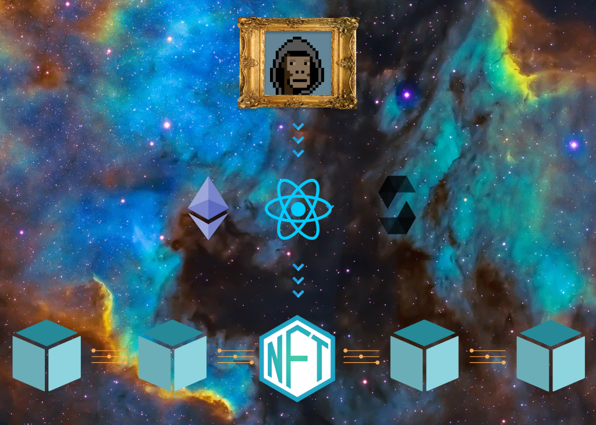

# 🎨 NFT Art Mint 🎨

A tool that facilitates artists in minting NFTs among the Ethereum [ERC-721](https://ethereum.org/en/developers/docs/standards/tokens/erc-721/) token boom. 💥

 

## Minimum Viable Product 🔬

#### ***This section will become more detailed as I learn and become more aware of the intricacies of an Ethereum dApp project.***

### User Stories:

> A user can upload a digital art file to the **NFT Art Mint** UI. 

> A user can mint an NFT to an Ethereum testnet. 

 

## Stretch Goals 🔭

#### ***The ultimate stretch goal is an NFT art generator that mints collections on the Polygon L2 sidechain.*** 

 

**Mainnet Deployment**
> Once the app reaches MVP, allow the app to connect to a mainnet on Ethereum blockchain or an L2 sidechain like Polygon. Create a collection and enter a markektplace like [opensea.io](https://www.opensea.io)

 

**In-App Art Generator**
> A generative art feature on the React application layer using the `canvas` API. This feature should allow an artist to create portraits by layers and generate *nm* unique combinations.

 

**Holographic Feature** 
> An artist is able to create a "holographic NFT" as a super-rare or flagship NFT of the collection (some exclusive layer(s) not featured on any other permutation). 

 

**NFT Royalties**
> An NFT owner/minter receives royalties on each resale of their NFTs indefinitely.

 

## Technology Stack 🧬

[ReactJS](https://reactjs.org/)

[Styled Components](https://styled-components.com/)

[Metamask](https://metamask.io/)

[NodeJS](https://nodejs.org/)

[Web3JS](https://web3js.readthedocs.io/)

[Solidity Smart Contracts](https://docs.soliditylang.org/)

[Ethereum Blockchain](https://ethereum.org/)

[Polygon (MATIC) Blockchain](https://polygon.technology/)

[IPFS Protocol](https://www.ipfs.com/)

[Truffle Suite](https://www.trufflesuite.com/)

 

## Project Requirements 📋

- **Smart Contract(s)** - A user can submit a transaction to a Solidity smart contract.

- **Test Suite** - A testing suite with 5 tests using Truffle Test or Mocha

- **Truffle Suite** - Local testnet product by Consensys.

- **Web3 User Interface** - ReactJS and Using Metamask, a user sees can interact with the blockchain and see state changes to the UI from that blockchain on the UI.

- **Deployed** - The smart contract(s) must be deployed to an EVM compatible testnet or mainnet.

- **Hosted** - Netlify for hosting front end code.

- **Scripts** - The project has `scripts/bootstrap`, `scripts/server`, and `scripts/tests` to point to local build and dependency checks, spin up local server and testnet, and run the project test suite respectively.

- **Screencast** - This includes walking through a transaction and seeing the state update.